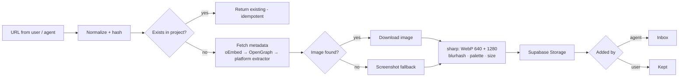

# Ilham ✦ إلهام — خطة البناء

> منصة استلهام شخصية بروح Dribbble و Behance.
> المراجع تتجمع في **مشاريع**، تضيفها أنت أو **الإيجنت**، وكل كرت له بريفيو واضح، ولما تضغط عليه يوديك لصفحة العمل الأصلية.

---

## 1. الـ North Star

- **The work is the hero** — الواجهة تختفي، والمراجع هي اللي تتكلم.
- **ثلاث طرق تدخل منها المراجع:**
  1. **أنت** — تلصق رابط، أو تسحب صورة، أو Share من الجوال.
  2. **الإيجنت** — عن طريق REST API أو MCP server.
  3. **الأتمتة** — جدولة يومية، أو زر "Find more" داخل المشروع.
- **الضغطة الوحدة = صفحة العمل الأصلية.** كل شي ثاني (نقل، حذف، تفاصيل) يكون في قائمة `⋯`.

---

## 2. القرارات الأساسية

| القرار | الاختيار | ليش |
|---|---|---|
| Frontend | **Next.js** (App Router) + TypeScript + Tailwind v4 + shadcn/ui + Motion | سريع للبناء، SSR للبريفيوهات، وبيئة قوية |
| Backend / DB | **Supabase** (Postgres + Auth + Storage + pgvector) | كل شي في مكان واحد، وفيه RLS. وهو موصول عندك MCP |
| Hosting | **Vercel** | Deploy من GitHub مباشرة، وموصول عندك MCP |
| واجهة الإيجنت | **REST API v1 + Remote MCP server** (`/api/mcp`) | أي إيجنت أو أداة أتمتة (Claude، n8n، Make) تقدر تضيف |
| البريفيوهات | **نخزنها عندنا** في Supabase Storage (WebP) | الروابط تموت والمواقع تمنع الـ hotlink، والبريفيو لازم يكون ثابت |
| شكل الشبكة | **4:3 uniform** (نفس نسبة Dribbble) افتراضياً + خيار Masonry | شكل نظيف ومتناسق مثل الاستوديوهات |
| المستخدمين | **Single-user أول**، بس السكيما جاهزة لأكثر من مستخدم (`owner_id` + RLS) | نطلق بسرعة بدون ما نعيد البناء بعدين |
| الاتجاه | **RTL-ready** من أول يوم (Tailwind logical properties) | عربي/إنجليزي بدون إعادة تصميم |

---

## 3. تجربة الاستخدام (UX)

### الشاشات

| الشاشة | الوظيفة |
|---|---|
| **Home — Projects** | كروت المشاريع، وغلاف كل مشروع collage من 4 صور (مثل moodboards في Behance) + عدد المراجع + آخر إضافة من الإيجنت |
| **Project — Grid** | هيدر فيه الاسم والـ brief وحالة الإيجنت (`● Agent 2h · +12`)، وفلاتر chips (المنصة، النوع، التاقات، أضافه: أنا / ✦ AI)، وتحتها الشبكة |
| **Inbox — Triage** | كل شي يضيفه الإيجنت يدخل هنا أول. بالجوال: swipe يمين = Keep، يسار = Discard. بالكمبيوتر: `K` / `X` / الأسهم |
| **Quick View** (من قائمة `⋯`) | بريفيو كبير + بيانات العمل + زر `Open source ↗` |
| **Present Mode** | المشروع يتحول عرض fullscreen تعرضه على العميل |
| **Settings** | API keys، Webhooks، المصادر المفضلة |

### الكرت — قلب المنتج

- بريفيو **4:3**، الحواف `radius: 10px`، وقبل ما تحمل الصورة يطلع **blurhash** فوق اللون الغالب في الصورة. ما فيه مربعات رمادية أبداً.
- **Hover (كمبيوتر):** gradient من تحت + العنوان + favicon المنصة + اسم المصمم. الفيديو والـ GIF يشتغلون muted loop.
- **جوال:** الفيديو يشتغل لما يوصل الكرت نص الشاشة (IntersectionObserver).
- **Badge ✦** على المراجع اللي جابها الإيجنت، وفيه tooltip يقول **ليش اختارها**.
- **Click:** يفتح `source_url` في تاب جديد (`noopener`).

### Wireframes

**Desktop**
```
┌─────────────┬────────────────────────────────────────────────────┐
│ ✦ ILHAM     │ VR Onboarding                       [Present] [+]  │
│             │ dark · cinematic · spatial UI    ● Agent 2h · +12  │
│ Projects    │ [All] [Dribbble] [Behance] [Motion] [3D] [✦ AI]    │
│ Inbox    12 │ ┌─────────┐ ┌─────────┐ ┌─────────┐ ┌─────────┐    │
│ ─────────── │ │         │ │         │ │    ▶    │ │       ✦ │    │
│ VR Onboard. │ │   4:3   │ │   4:3   │ │   4:3   │ │   4:3   │    │
│ Brand X     │ └─────────┘ └─────────┘ └─────────┘ └─────────┘    │
│ Motion Refs │  ◉ Title       ◉ Title     ◉ Title     ◉ Title     │
└─────────────┴────────────────────────────────────────────────────┘
```

**Mobile**
```
┌────────────────────────┐
│ VR Onboarding      ⋯   │
│ [All] [Dribbble] [✦AI] │
│ ┌─────────┐┌─────────┐ │
│ │         ││       ✦ │ │
│ └─────────┘└─────────┘ │
│ ┌─────────┐┌─────────┐ │
│ │    ▶    ││         │ │
│ └─────────┘└─────────┘ │
│                    (+) │
│  ⌂     ▦     ⇆12    ⚙  │
└────────────────────────┘
```

### Responsive

| | Mobile | Tablet | Desktop |
|---|---|---|---|
| الأعمدة | 2 | 3 | 4–5 (`auto-fill, minmax(280px, 1fr)`) |
| التنقل | Bottom bar | Sidebar ينطوي | Sidebar ثابت |
| الإضافة | زر FAB + Share Sheet | FAB | `Cmd+V` في أي مكان + Drag & Drop |
| البحث | زر بحث | `Cmd+K` | `Cmd+K` Command Palette |

### الهوية البصرية للمنتج

- **Dark-first:** الخلفية `#0B0B0C`، الكروت بدون borders، والصور هي الشي الوحيد الملوّن في الشاشة.
- **لون واحد للإيجنت:** `Signal Lime #C6FF3D`، ما يُستخدم إلا للأشياء اللي لمسها الـ AI (badge ✦، حالة الإيجنت، الـ Inbox). كذا بنظرة وحدة تعرف مين أضاف المرجع.
- **الخطوط:** Geist (لاتيني) + IBM Plex Sans Arabic (عربي).
- **الحركة:** hover بـ `scale 1.02` + ظل، مدة 180ms ease-out. الكرت ينتقل لـ Quick View بـ shared-element transition، والـ swipe في الـ Inbox فيه physics حقيقية.

---

## 4. Data Model (Supabase / Postgres)

```sql
-- المشاريع
create table projects (
  id            uuid primary key default gen_random_uuid(),
  owner_id      uuid not null references auth.users on delete cascade,
  slug          text not null,
  name          text not null,
  description   text,
  brief         jsonb not null default '{}',   -- تعليمات الإيجنت (شوف القسم 6)
  auto_curate   boolean not null default false,
  webhook_url   text,                          -- زر "Find more"
  visibility    text not null default 'private'
                check (visibility in ('private','unlisted','public')),
  share_token   text unique,
  created_at    timestamptz not null default now(),
  unique (owner_id, slug)
);

-- المرجع نفسه (يتخزن مرة وحدة، ويقدر يكون في أكثر من مشروع)
create table items (
  id              uuid primary key default gen_random_uuid(),
  owner_id        uuid not null references auth.users on delete cascade,
  source_url      text not null,
  canonical_url   text not null,
  url_hash        text not null,              -- sha256(canonical_url)
  platform        text,                       -- dribbble | behance | vimeo | awwwards | ...
  media_type      text,                       -- image | video | gif | website
  title           text,
  author_name     text,
  author_url      text,
  preview_path    text,                       -- previews/{id}/1280.webp
  video_path      text,                       -- loop قصير (Phase 3)
  width int, height int,
  dominant_color  text,
  palette         text[],
  blurhash        text,
  phash           text,                       -- يكشف نفس العمل لو انتشر في أكثر من منصة
  tags            text[] not null default '{}',
  embedding       vector(1024),               -- Phase 4: semantic search
  created_at      timestamptz not null default now(),
  unique (owner_id, url_hash)
);

-- جلسات الإيجنت
create table agent_runs (
  id            uuid primary key default gen_random_uuid(),
  project_id    uuid not null references projects on delete cascade,
  trigger       text not null,               -- manual | schedule | webhook
  query         text,
  status        text not null default 'running',
  items_added   int not null default 0,
  summary       text,
  started_at    timestamptz not null default now(),
  finished_at   timestamptz
);

-- ربط المرجع بالمشروع
create table project_items (
  project_id    uuid references projects on delete cascade,
  item_id       uuid references items on delete cascade,
  status        text not null default 'kept'
                check (status in ('inbox','kept','discarded')),
  added_by      text not null check (added_by in ('user','agent')),
  agent_run_id  uuid references agent_runs on delete set null,
  reason        text,                         -- ليش الإيجنت اختاره
  note          text,
  position      double precision,             -- الترتيب اليدوي
  added_at      timestamptz not null default now(),
  primary key (project_id, item_id)
);

-- مفاتيح الإيجنت
create table api_keys (
  id            uuid primary key default gen_random_uuid(),
  owner_id      uuid not null references auth.users on delete cascade,
  name          text not null,                -- "claude-curator", "n8n"
  key_hash      text not null unique,         -- ما نخزن المفتاح نفسه أبداً
  scopes        text[] not null default '{projects:read,items:write}',
  last_used_at  timestamptz,
  created_at    timestamptz not null default now()
);
```

**RLS:** كل جدول عليه `owner_id = auth.uid()`. الـ API يتحقق من المفتاح ويشتغل بالـ service role على `owner_id` صاحب المفتاح.

---

## 5. Ingestion Pipeline — كيف الرابط يصير بريفيو



1. **Normalize:** نشيل `utm_*` و `fbclid` و `ref`، والـ host يصير lowercase، ونشيل الـ trailing slash. بعدها نحسب `url_hash`.
2. **Dedupe:** لو الرابط موجود نرجّع نفس العنصر. يعني الإيجنت يقدر يرسل نفس الرابط عشر مرات وما يتكرر.
3. **Metadata:** نجرب oEmbed أول (YouTube، Vimeo)، بعدها OpenGraph/Twitter Cards، وبعدها extractor خاص بالمنصة.
4. **Preview:** إذا الإيجنت أرسل `image_url` نستخدمه، وإلا ناخذ `og:image`، وإذا ما لقينا شي نسوي screenshot (Playwright أو خدمة مثل Microlink / ScreenshotOne).
5. **Processing:** بـ `sharp` نطلع مقاسين WebP (640 و 1280) + blurhash + palette + الأبعاد. تقريباً 150KB للعنصر.
6. **Status:** إذا الإيجنت هو اللي أضاف يروح `inbox`، وإذا أنت `kept`.

**Extractors** — كل منصة لها ملف صغير بنفس الـ interface:

```ts
// lib/ingest/extractors/types.ts
export interface Extractor {
  platform: string
  match(url: URL): boolean
  extract(url: URL, html: string): Promise<Partial<ItemMeta>>
}
```

نبدأ بـ: `dribbble` · `behance` · `vimeo` · `youtube` · `awwwards` · `artstation` · `pinterest` · `generic`

**Security:** حماية من SSRF (نمنع الـ IPs الداخلية والـ localhost)، timeout بـ 10 ثواني، وحد أقصى للصورة 15MB.

---

## 6. طبقة الإيجنت

### REST API v1

| Method | Endpoint | الوظيفة |
|---|---|---|
| `GET` | `/api/v1/projects` | قائمة المشاريع |
| `POST` | `/api/v1/projects` | مشروع جديد |
| `GET` | `/api/v1/projects/{slug}` | المشروع + الـ brief + آخر 30 عنصر (عشان ما يكرر) |
| `GET` | `/api/v1/projects/{slug}/items?status=&cursor=` | العناصر |
| `POST` | `/api/v1/projects/{slug}/items` | يضيف عنصر أو batch (لين 50) |
| `PATCH` | `/api/v1/projects/{slug}/items/{id}` | يغير status / tags / note |
| `GET` | `/api/v1/projects/{slug}/taste` | ملخص ذوقك: وش احتفظت فيه ووش رميته |
| `POST` / `PATCH` | `/api/v1/runs` · `/api/v1/runs/{id}` | يسجل جلسة الإيجنت |

**Auth:** `Authorization: Bearer ilham_sk_…`، المفتاح يتخزن hashed وله scopes.

```bash
curl -X POST https://ilham.vercel.app/api/v1/projects/vr-onboarding/items \
  -H "Authorization: Bearer $ILHAM_KEY" \
  -H "Content-Type: application/json" \
  -d '{
    "agent_run_id": "…",
    "items": [{
      "url": "https://dribbble.com/shots/…",
      "image_url": "https://cdn.dribbble.com/…/shot.png",
      "title": "Spatial onboarding — visionOS",
      "tags": ["type:ui", "tech:visionos", "style:glass"],
      "reason": "Depth layering + glass panels match the brief's spatial-UI mood"
    }]
  }'
# → 202 { "items": [{ "id": "…", "status": "queued" | "duplicate" }] }
```

> اللي يرسله الإيجنت نعتبره **hints**. السيرفر دايم يعيد جلب الـ metadata بنفسه، فالبريفيو يطلع صحيح حتى لو الإيجنت غلط.

### MCP Server (`/api/mcp`)

نفس الـ API بس على شكل tools يفهمها أي إيجنت مباشرة:

| Tool | الوظيفة |
|---|---|
| `list_projects()` | المشاريع |
| `get_project(slug)` | الـ brief + الإحصائيات + آخر العناصر |
| `create_project(name, brief?)` | مشروع جديد |
| `add_inspiration(project, items[])` | يضيف batch |
| `get_taste(project)` | ذوقك عشان يتعلم منه |
| `start_run(project, query)` / `finish_run(run_id, summary)` | سجل الجلسات |

نبنيه بـ Vercel MCP adapter (`mcp-handler`). في Claude Code يتربط كذا:

```bash
claude mcp add --transport http ilham https://ilham.vercel.app/api/mcp \
  --header "Authorization: Bearer $ILHAM_KEY"
```

(OAuth للـ connectors في claude.ai نضيفه في Phase 4.)

### Project Brief — اللي يخلي الإيجنت ذكي

كل مشروع عنده brief، والإيجنت يقراه قبل ما يبدأ يدور:

```yaml
goal: Onboarding flow for a VR fitness app
mood: [dark, cinematic, neon accents, high contrast]
keywords: [spatial UI, visionOS, glassmorphism, onboarding, depth]
sources: [dribbble, behance, awwwards, mobbin, vimeo]
exclude: [flat illustrations, stock 3D characters, light mode]
quota: 15            # كم مرجع في كل run
min_quality: high    # المصمم الأصلي بس، لا reposts ولا aggregators
```

### Taste Loop

`get_taste` يرجّع آخر المراجع اللي احتفظت فيها والمراجع اللي رميتها مع التاقات حقتها. كل ما تسوي Swipe، الإيجنت يفهم ذوقك أكثر في الـ run الجاي.

---

## 7. الأتمتة — Playbook

| النمط | كيف يشتغل | مثال |
|---|---|---|
| **A. On-demand** | تكلم الإيجنت مباشرة وهو يستخدم الـ MCP | "جب لي 10 مراجع motion لـ logo reveals وحطها في `brand-x-motion`" |
| **B. Scheduled** | Routine (Claude Code أو n8n) يمر على كل مشروع `auto_curate = true` | كل يوم 9 الصبح |
| **C. Find more** | زر داخل المشروع يرسل webhook لأتمتتك ومعه الـ brief | تضغط ✦ وبعد دقيقة يتعبى الـ Inbox |

### Agent Prompt Template

```text
You are Ilham's curator agent.
1. get_project("{slug}") — read the brief and recent items.
2. get_taste("{slug}") — learn what I keep vs discard.
3. start_run("{slug}", "<your search plan>").
4. Search the brief's sources for {quota} pieces matching mood + keywords.
   Skip anything in `exclude` or already in the project.
5. Prefer the original creator's page — no reposts, no aggregators.
6. For each pick: url, direct high-res image_url, title,
   3–5 namespaced tags, and a one-sentence reason tied to the brief.
7. add_inspiration in ONE batch, then finish_run with a 2-line summary.
```

### خريطة المصادر حسب المجال

| المجال | المصادر |
|---|---|
| UI / Product | Dribbble · Mobbin · Godly · Land-book · Awwwards · Siteinspire |
| Motion | Vimeo · Behance (Motion) · YouTube · Instagram |
| 3D | ArtStation · Behance · Sketchfab |
| AR / VR / Spatial | Behance · Dribbble (`visionOS`, `spatial`) · YouTube · Awwwards (WebXR) |
| Branding | Behance · Brand New · Fonts In Use |
| Typography | Fonts In Use · Typewolf |

> الأداة شخصية: نخزن thumbnail ورابط المصدر واسم المصمم، وما نعيد نشر الأعمال.

---

## 8. نظام التسمية والتنظيم

- **Project slugs:** `{client}-{project}-{scope}`، مثل `self-ilham-brand` و `nike-ar-launch-concept` و `studio-motion-library`.
- **Tags بـ namespaces** (عشان الفلترة والإيجنت يكونون دقيقين):

  | Namespace | أمثلة |
  |---|---|
  | `type:` | `ui` · `motion` · `3d` · `branding` · `xr` · `typography` |
  | `style:` | `glass` · `brutalist` · `y2k` · `editorial` · `minimal` |
  | `tech:` | `visionos` · `webgl` · `c4d` · `blender` · `unreal` · `spline` |
  | `mood:` | `cinematic` · `playful` · `luxury` · `dark` |

- **Storage:** `previews/{item_id}/640.webp` · `previews/{item_id}/1280.webp` · `videos/{item_id}/loop.mp4`
- **API keys:** اسم واضح لكل أداة، مثل `claude-curator` و `n8n-daily` و `ios-shortcut`. كذا تقدر تلغي أي وحدة لحالها.

---

## 9. هيكل الريبو

```
ilham/
├── app/
│   ├── (app)/
│   │   ├── page.tsx                   # Home — المشاريع
│   │   ├── p/[slug]/page.tsx          # Grid المشروع
│   │   ├── p/[slug]/present/page.tsx  # Present mode
│   │   ├── inbox/page.tsx             # Triage
│   │   └── settings/                  # API keys · webhooks
│   ├── share/[token]/page.tsx         # رابط العميل (read-only)
│   └── api/
│       ├── v1/                        # REST
│       └── mcp/route.ts               # MCP server
├── components/
│   ├── grid/                          # Grid · Card · CardVideo · Masonry
│   ├── triage/                        # SwipeDeck
│   └── ui/                            # shadcn
├── lib/
│   ├── ingest/
│   │   ├── normalize.ts
│   │   ├── metadata.ts
│   │   ├── preview.ts
│   │   ├── dedupe.ts
│   │   └── extractors/                # dribbble.ts · behance.ts · vimeo.ts …
│   ├── api/                           # auth.ts · schemas.ts (zod)
│   └── supabase/
├── supabase/migrations/
└── docs/PLAN.md
```

---

## 10. Roadmap

> التقديرات على افتراض إننا نبني مع Claude Code.

### Phase 0 — Foundation · تقريباً يوم
- Next.js + TS + Tailwind + shadcn + ESLint/Prettier
- مشروع Supabase + migrations + RLS
- مشروع Vercel + env vars + Preview deploys
- Design tokens (dark/light + RTL)

**✅ Done when:** صفحة login منشورة على Vercel وشغالة.

### Phase 1 — MVP Core · تقريباً أسبوع
- Auth (magic link)
- Projects CRUD + covers تلقائية
- Add by URL: Paste، `Cmd+V`، FAB
- Ingestion v1: normalize → oEmbed/OG → preview → sharp → storage
- Grid 4:3 + hover + click to source + infinite scroll (cursor)
- Responsive كامل + bottom nav

**✅ Done when:** تلصق رابط Dribbble من الجوال، يطلع كرت ببريفيو في أقل من 5 ثواني، وتضغط عليه يفتح لك الشوت الأصلي.

### Phase 2 — Agent Layer · تقريباً 4 أيام
- API keys (hashed + scopes) + صفحة إدارتها
- REST v1 + zod validation + batch + idempotency
- MCP server
- Inbox + Swipe triage
- Badge ✦ + reason + سجل `agent_runs`

**✅ Done when:** تقول لـ Claude "جب 10 مراجع spatial UI لمشروع `vr-onboarding`"، وخلال دقيقة تلقاها في الـ Inbox ومعها أسبابها.

### Phase 3 — Automation · تقريباً 4 أيام
- محرر الـ Brief (form يحفظ في jsonb)
- Scheduled curation (Claude routine أو n8n)
- زر "Find more" + webhooks
- `get_taste` endpoint
- Extractors خاصة لكل منصة + video loops (mp4 ≤ 3MB)
- pHash dedupe بين المنصات
- Background jobs (Inngest أو Supabase Queues) بدل المعالجة inline

**✅ Done when:** كل صباح تفتح الـ Inbox وتلقى مراجع جديدة لكل مشروع مفعّل، بدون تكرار.

### Phase 4 — Wow & Polish
- **PWA + Share Target** (Android) + **iOS Shortcut** يرسل للـ API (iOS ما يدعم Share Target)
- Chrome extension أو bookmarklet
- **Search by color:** تضغط على لون، وتطلع لك كل المراجع اللي فيها نفس الباليت
- **Auto-tagging + Semantic search:** Claude vision يكتب وصف وتاقات، و embeddings في pgvector. تكتب "dark cinematic onboarding with glass" ويطلع لك اللي تبيه
- **Present Mode** + روابط مشاركة للعميل (unlisted, read-only)
- Weekly digest: أفضل 10 مراجع الأسبوع
- OAuth للـ MCP عشان يشتغل كـ connector في claude.ai

---

## 11. الـ Wow Layer — وش يميزه عن أي moodboard

1. **Swipe Triage:** الإيجنت يقترح وأنت تختار. 50 مرجع تخلصها في دقيقتين.
2. **✦ Reasons:** كل مرجع جابه الإيجنت معه سبب واضح، وما فيه صناديق سوداء.
3. **Taste Loop:** كل ما استخدمته أكثر، صار الإيجنت يفهم ذوقك أكثر.
4. **Search by color + meaning:** تدور بالمود، مو بس بالكلمات.
5. **Present Mode:** المشروع يتحول عرض للعميل بضغطة وحدة. هذي أداة كرييتف دايركتر، مو مجرد bookmarks.

---

## 12. المخاطر والحلول

| الخطر | الحل |
|---|---|
| مواقع تمنع السكرابنق أو الـ hotlink | نخزن البريفيو عندنا + screenshot fallback + الإيجنت يرسل `image_url` |
| Instagram و Pinterest يطلبون تسجيل دخول | Share Sheet من الجوال، والإيجنت يرسل الصورة مباشرة |
| نفس العمل في أكثر من منصة | canonical URL + pHash |
| الإيجنت يغرقك بمراجع ضعيفة | Inbox + quota + `exclude` + Taste Loop |
| تكلفة التخزين | WebP بمقاسين (~150KB للعنصر). مساحة Supabase المجانية تكفي آلاف المراجع |
| مفاتيح API تتسرب | hashed + scopes + `last_used_at` + إلغاء بضغطة |

---

## 13. الخطوة الجاية

1. ننشئ مشروع Supabase ومشروع Vercel، وأقدر أسويهم مباشرة من هنا.
2. نبدأ **Phase 0 + Phase 1** على هذا الريبو.
3. بعد ما يشتغل الـ MVP، نربط الإيجنت (Phase 2) ونجرب أول run حقيقي على مشروع من مشاريعك.
