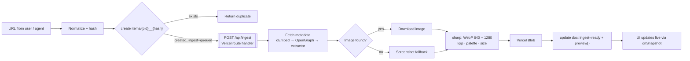

# Ilham ✦ إلهام — خطة البناء

> منصة استلهام شخصية بروح Dribbble و Behance.
> المراجع تتجمع في **مشاريع**، تضيفها أنت أو **الإيجنت**، وكل كرت له بريفيو واضح، ولما تضغط عليه يوديك لصفحة العمل الأصلية.

---

## 1. الـ North Star

- **The work is the hero** — الواجهة تختفي، والمراجع هي اللي تتكلم.
- **ثلاث طرق تدخل منها المراجع:**
  1. **أنت** — تلصق رابط، أو تسحب صورة، أو Share من الجوال.
  2. **الإيجنت** — عن طريق REST API أو MCP server.
  3. **الأتمتة** — جدولة يومية، أو زر "Find more" داخل المشروع.
- **الضغطة الوحدة = صفحة العمل الأصلية.** كل شي ثاني (نقل، حذف، تفاصيل) يكون في قائمة `⋯`.

---

## 2. القرارات الأساسية

| القرار | الاختيار | ليش |
|---|---|---|
| Frontend | **Next.js** (App Router) + TypeScript + Tailwind v4 + shadcn/ui + Motion | سريع للبناء، SSR للبريفيوهات، وبيئة قوية |
| Backend | **Firebase على خطة Spark المجانية**: Firestore + Auth بس | realtime جاهز، وبدون بطاقة ولا فاتورة |
| Hosting | **Vercel Hobby** للواجهة والـ API والـ MCP **والمعالجة** (route handlers) + **Vercel Blob** للبريفيوهات | Functions و Storage في Firebase تحتاج Blaze، و Vercel يعطيها مجاناً |
| واجهة الإيجنت | **REST API v1 + Remote MCP server** (`/api/mcp`) | أي إيجنت أو أداة أتمتة (Claude، n8n، Make) تقدر تضيف |
| البريفيوهات | **نخزنها عندنا** في Vercel Blob (WebP) | الروابط تموت والمواقع تمنع الـ hotlink، والبريفيو لازم يكون ثابت |
| شكل الشبكة | **4:3 uniform** (نفس نسبة Dribbble) افتراضياً + خيار Masonry | شكل نظيف ومتناسق مثل الاستوديوهات |
| المستخدمين | **Single-user أول**، بس كل البيانات تحت `users/{uid}` | جاهز لأكثر من مستخدم بدون إعادة بناء |
| الاتجاه | **RTL-ready** من أول يوم (Tailwind logical properties) | عربي/إنجليزي بدون إعادة تصميم |

### التقسيم بين المنصتين

```
Vercel   → الواجهة · /api/ingest (رابط ← بريفيو) · /api/sync · REST API v1 · MCP · Blob  ← "البوابة والعضلات"
Firebase → Firestore (البيانات، realtime) · Auth                                          ← "الذاكرة"
```

> **تحديث (أكتوبر 2026): بدون Blaze.** المعالجة انتقلت من Cloud Functions إلى route handlers في Next.js على Vercel،
> والبريفيوهات من Cloud Storage إلى Vercel Blob. الـ server يكلم Firestore بـ Admin SDK (service account)، وهذا يشتغل على Spark.
> الخطوات كاملة: [`DEPLOY.md`](DEPLOY.md).

### أشياء لازم تعرفها قبل تبدأ

| الموضوع | الواقع | وش نسوي |
|---|---|---|
| **ليش مو Blaze** | Cloud Functions تحتاج Blaze، و Cloud Storage صار يحتاجها بعد من 3 فبراير 2026 | ما نستخدمهم. كل شي يحتاج سيرفر يشتغل على Vercel |
| **السقف بدل الفاتورة** | Spark و Vercel Hobby و Blob Hobby كلها مجانية بسقف: لو خلصت الكوتا تتوقف الخدمة، ما تنسحب فلوس | نراقب الاستهلاك من لوحات Firebase و Vercel |
| **Email link** | على Spark بس **5 إيميلات دخول باليوم** | Google هو طريق الدخول الأساسي |
| **المنطقة** | مكان Firestore **ما يتغير بعدين**، والمتصفح يكلمه أكثر من السيرفر بكثير | `me-central2` (الدمام) أقرب شي لمستخدم في الخليج. المعالجة على Vercel تتحمل المسافة لأنها تشتغل بالخلفية |
| **الجدولة** | Vercel Cron على Hobby يشتغل مرة وحدة باليوم | job يومي واحد يكفي لكل المشاريع |
| **Vercel Hobby** | للاستخدام الشخصي غير التجاري | لو صار شغل استوديو تجاري: Vercel Pro |

**الكوتا المجانية اللي تهمنا:**

| المنتج | المجاني | استهلاك Ilham المتوقع |
|---|---|---|
| Firestore (Spark) | 1 GiB تخزين · 50K قراءة/يوم · 20K كتابة/يوم | ~20K قراءة/يوم و ~1K كتابة/يوم |
| Vercel Blob (Hobby) | 1 GB تخزين · 10 GB نقل · 2K رفع/شهر | كل مرجع ~150KB ورفعتين ← ~6K مرجع، و ~1000 مرجع جديد/شهر |
| Vercel Functions (Hobby) | ضمن حصة الحساب | طلب واحد لكل مرجع (~2-8 ثواني) |
| Auth | 50K MAU | مستخدم واحد أو فريق صغير |

---

## 3. تجربة الاستخدام (UX)

### الشاشات

| الشاشة | الوظيفة |
|---|---|
| **Home — Projects** | كروت المشاريع، وغلاف كل مشروع collage من 4 صور (مثل moodboards في Behance) + عدد المراجع + آخر إضافة من الإيجنت |
| **Project — Grid** | هيدر فيه الاسم والـ brief وحالة الإيجنت (`● Agent 2h · +12`)، وفلاتر chips (المنصة، النوع، التاقات، أضافه: أنا / ✦ AI)، وتحتها الشبكة |
| **Inbox — Triage** | كل شي يضيفه الإيجنت يدخل هنا أول. بالجوال: swipe يمين = Keep، يسار = Discard. بالكمبيوتر: `K` / `X` / الأسهم |
| **Quick View** (من قائمة `⋯`) | بريفيو كبير + بيانات العمل + زر `Open source ↗` |
| **Present Mode** | المشروع يتحول عرض fullscreen تعرضه على العميل |
| **Settings** | API keys، Webhooks، المصادر المفضلة |

### الكرت — قلب المنتج

- بريفيو **4:3**، الحواف `radius: 10px`، وقبل ما تحمل الصورة يطلع **LQIP** (نسخة WebP صغيرة جداً، blur) فوق اللون الغالب في الصورة. ما فيه مربعات رمادية أبداً.
- **Hover (كمبيوتر):** gradient من تحت + العنوان + favicon المنصة + اسم المصمم. الفيديو والـ GIF يشتغلون muted loop.
- **جوال:** الفيديو يشتغل لما يوصل الكرت نص الشاشة (IntersectionObserver).
- **Badge ✦** على المراجع اللي جابها الإيجنت، وفيه tooltip يقول **ليش اختارها**.
- **Live:** الواجهة تسمع لـ Firestore (`onSnapshot`). تلصق الرابط، يطلع skeleton، وأول ما تخلص المعالجة يتحول بريفيو قدامك بدون refresh.
- **Click:** يفتح `sourceUrl` في تاب جديد (`noopener`).

### Wireframes

**Desktop**
```
┌─────────────┬────────────────────────────────────────────────────┐
│ ✦ ILHAM     │ VR Onboarding                       [Present] [+]  │
│             │ dark · cinematic · spatial UI    ● Agent 2h · +12  │
│ Projects    │ [All] [Dribbble] [Behance] [Motion] [3D] [✦ AI]    │
│ Inbox    12 │ ┌─────────┐ ┌─────────┐ ┌─────────┐ ┌─────────┐    │
│ ─────────── │ │         │ │         │ │    ▶    │ │       ✦ │    │
│ VR Onboard. │ │   4:3   │ │   4:3   │ │   4:3   │ │   4:3   │    │
│ Brand X     │ └─────────┘ └─────────┘ └─────────┘ └─────────┘    │
│ Motion Refs │  ◉ Title       ◉ Title     ◉ Title     ◉ Title     │
└─────────────┴────────────────────────────────────────────────────┘
```

**Mobile**
```
┌────────────────────────┐
│ VR Onboarding      ⋯   │
│ [All] [Dribbble] [✦AI] │
│ ┌─────────┐┌─────────┐ │
│ │         ││       ✦ │ │
│ └─────────┘└─────────┘ │
│ ┌─────────┐┌─────────┐ │
│ │    ▶    ││         │ │
│ └─────────┘└─────────┘ │
│                    (+) │
│  ⌂     ▦     ⇆12    ⚙  │
└────────────────────────┘
```

### Responsive

| | Mobile | Tablet | Desktop |
|---|---|---|---|
| الأعمدة | 2 | 3 | 4–5 (`auto-fill, minmax(280px, 1fr)`) |
| التنقل | Bottom bar | Sidebar ينطوي | Sidebar ثابت |
| الإضافة | زر FAB + Share Sheet | FAB | `Cmd+V` في أي مكان + Drag & Drop |
| البحث | زر بحث | `Cmd+K` | `Cmd+K` Command Palette |

### الهوية البصرية للمنتج

- **Dark-first:** الخلفية `#0B0B0C`، الكروت بدون borders، والصور هي الشي الوحيد الملوّن في الشاشة.
- **لون واحد للإيجنت:** `Signal Lime #C6FF3D`، ما يُستخدم إلا للأشياء اللي لمسها الـ AI (badge ✦، حالة الإيجنت، الـ Inbox). كذا بنظرة وحدة تعرف مين أضاف المرجع.
- **الخطوط:** Geist (لاتيني) + IBM Plex Sans Arabic (عربي).
- **الحركة:** hover بـ `scale 1.02` + ظل، مدة 180ms ease-out. الكرت ينتقل لـ Quick View بـ shared-element transition، والـ swipe في الـ Inbox فيه physics حقيقية.

---

## 4. Data Model (Firestore)

Firestore ما فيه joins، فنصممه **flat و denormalized**. كل الشبكة تجي من query وحدة.

```
users/{uid}
├── projects/{projectId}
│     slug, name, description,
│     brief{}            ← تعليمات الإيجنت (شوف القسم 6)
│     autoCurate, webhookUrl, visibility, shareToken,
│     cover[]            ← آخر 4 previews (للغلاف بدون queries زيادة)
│     counts{ kept, inbox }, createdAt
│
├── items/{projectId}__{urlHash}      ← ID مركّب = dedupe مجاني
│     projectId, urlHash, sourceUrl, canonicalUrl,
│     platform, mediaType, title, authorName, authorUrl,
│     preview{ w640, w1280, video?, width, height, lqip, dominantColor, palette },
│     colorBuckets[]     ← "teal-dark", "orange-mid" … للبحث باللون
│     searchTokens[]     ← كلمات العنوان والتاقات (lowercase) للبحث البسيط
│     tags[],
│     status:  inbox | kept | discarded
│     ingest:  queued | processing | ready | failed
│     addedBy: user | agent,  agentRunId, reason, note, position,
│     embedding          ← Vector (Phase 4)
│     addedAt
│
└── agentRuns/{runId}
      projectId, trigger, query, status, itemsAdded, summary, startedAt, finishedAt

apiKeys/{sha256(key)}   ← top-level: نلقى صاحب المفتاح مباشرة من الـ hash
      ownerId, name, scopes[], lastUsedAt, createdAt

shares/{shareToken}     ← روابط العميل (read-only)
      ownerId, projectId
```

**ليش الـ ID مركّب؟** `{projectId}__{urlHash}` يخلي نفس الرابط ما يتكرر في نفس المشروع. `create()` يفشل لو موجود، فنرجّع `duplicate` بدون أي query. ولو نفس المرجع انضاف لمشروع ثاني، يصير doc ثاني بس **البريفيو نفسه** يُستخدم من Storage (المسار مبني على `urlHash`).

**Indexes:**
- `items`: `projectId + status + addedAt desc` (الشبكة والـ Inbox)
- `items`: `projectId + colorBuckets (array-contains) + addedAt desc` (البحث باللون)
- `items`: vector index على `embedding` (Phase 4)

### Security Rules

```js
// firestore.rules
rules_version = '2';
service cloud.firestore {
  match /databases/{db}/documents {
    match /users/{uid}/{document=**} {
      allow read, write: if request.auth != null && request.auth.uid == uid;
    }
    match /apiKeys/{id}  { allow read, write: if false; }  // Admin SDK بس
    match /shares/{tok}  { allow read, write: if false; }
  }
}
```

> ما فيه `storage.rules`: البريفيوهات في Vercel Blob بروابط عامة عشوائية (مثل download tokens)، والرفع يمر من `/api/ingest` بعد التحقق من الـ ID token.

**Auth:** Google Sign-In (ضغطة وحدة) + Email link احتياط (5 إيميلات باليوم على Spark). `ILHAM_ALLOWED_EMAILS` على Vercel يحدد مين يقدر يستخدم المعالجة.

---

## 5. Ingestion Pipeline — كيف الرابط يصير بريفيو

الفكرة: **الواجهة تكتب الـ doc، وبعدها تنادي `/api/ingest`.** ما نحتاج queue ولا Inngest. الـ claim داخل transaction، فطلبين لنفس المرجع ما يشتغلون مع بعض. وأي مرجع يعلق في `queued` أو `processing` (الصفحة انقفلت، الطلب مات) يرجع يشتغل لحاله أول ما تفتح المشروع (`useResumeIngest`).



1. **Normalize** (في `shared/normalize.ts`، مشترك بين الواجهة والـ API): نشيل `utm_*` و `fbclid` و `ref`، والـ host يصير lowercase، ونشيل الـ trailing slash. بعدها نحسب `urlHash` (SHA-256).
2. **Create:** الواجهة تكتب الـ doc مباشرة (الـ rules تسمح لك)، والـ API يكتبه بـ Admin SDK. الحالة تبدأ `ingest: 'queued'`، و `status` يكون `inbox` إذا من الإيجنت أو `kept` إذا منك.
3. **Kick:** `POST /api/ingest { itemId }` مع ID token (`maxDuration: 60`). ينادى وقت الإنشاء، ولما تضغط Retry، ولما تغيّر البريفيو. رفع صورة يروح لنفس الـ route كـ multipart (الصور الكبيرة تتصغر في المتصفح تحت حد الـ 4.5MB حق Vercel).
4. **Metadata:** oEmbed أول (YouTube، Vimeo)، بعدها OpenGraph/Twitter Cards، وبعدها extractor خاص بالمنصة.
5. **Preview:** إذا الإيجنت أرسل `imageUrl` نستخدمه، وإلا `og:image`، وإذا ما لقينا شي نسوي screenshot (Microlink).
6. **Processing:** `sharp` يشتغل عادي في Vercel Functions، ويطلع مقاسين WebP (640 و 1280) + LQIP + palette + `colorBuckets` + الأبعاد. في التجربة الفعلية: 2 لـ 35KB لكل مقاس.
7. **Store:** `users/{uid}/previews/{urlHash}/640-<random>.webp` في Vercel Blob، كاش سنة. كل معالجة تاخذ اسم جديد، فالروابط اللي تستخدمها مشاريع ثانية ما تتغير.
8. **Update:** `ingest: 'ready'` + `preview{}`، وبعدها نحدّث عدادات المشروع وغلافه. والواجهة تتحدث لحالها.

**Retries بأمان:** الـ function تحجز المرجع بـ transaction (`queued → processing`) عشان ما يتعالج مرتين، وإذا نفس الرابط جاهز في مشروع ثاني تنسخ نتيجته بدون أي طلب للشبكة. وإذا فشلت تحط `ingest: 'failed'` مع السبب (`blocked` · `no-image` · `invalid-image`)، والكرت يطلع فيه "أضف بريفيو" و Retry. ما نستخدم `retry: true` حق Firebase عشان ما يدخل في loop.

### اللي طلع من التجربة الحقيقية: المواقع اللي تحجب السيرفرات

| المنصة | النتيجة من السيرفر | الحل في Ilham |
|---|---|---|
| YouTube · Vimeo | ✅ oEmbed رسمي | تلقائي |
| Mobbin · Godly · Linear · أغلب المواقع | ✅ OpenGraph | تلقائي |
| روابط الصور المباشرة (Pinterest CDN…) | ✅ | تلقائي |
| **Dribbble** | ⛔ AWS WAF challenge (202) | Bookmarklet، أو رفع screenshot، أو الإيجنت يرسل `imageUrl` |
| **Behance · ArtStation** | ⛔ 403 | نفس الحل |
| Microlink المجاني | ⛔ يرفض Dribbble (يبي Pro) | `MICROLINK_API_KEY` اختياري |

يعني المرجع **دايم ينحفظ ويفتح المصدر لما تضغطه**. إذا ما قدرنا نجيب صورته، يطلع كرت fallback بهوية المنصة وعنوان مأخوذ من الرابط، وتقدر تضيف له بريفيو بضغطة.

**Extractors** — كل منصة لها ملف صغير بنفس الـ interface:

```ts
// server/ingest/extractors.ts
export interface Extractor {
  platform: string
  match(url: URL): boolean
  extract(url: URL, html: string): Promise<Partial<ItemMeta>>
}
```

نبدأ بـ: `dribbble` · `behance` · `vimeo` · `youtube` · `awwwards` · `artstation` · `pinterest` · `generic`

**Security:** حماية من SSRF (نمنع الـ IPs الداخلية والـ localhost)، timeout بـ 10 ثواني، وحد أقصى للصورة 15MB.

**Next/Image:** البريفيوهات جاهزة بمقاساتها، فنستخدم `unoptimized` أو custom loader عشان ما نستهلك كوتا تحسين الصور في Vercel.

---

## 6. طبقة الإيجنت

الـ API والـ MCP يعيشون في Next.js على Vercel، ويتكلمون مع Firestore بـ **Firebase Admin SDK** (service account في env vars).

### REST API v1

| Method | Endpoint | الوظيفة |
|---|---|---|
| `GET` | `/api/v1/projects` | قائمة المشاريع |
| `POST` | `/api/v1/projects` | مشروع جديد |
| `GET` | `/api/v1/projects/{slug}` | المشروع + الـ brief + آخر 30 عنصر (عشان ما يكرر) |
| `GET` | `/api/v1/projects/{slug}/items?status=&cursor=` | العناصر |
| `POST` | `/api/v1/projects/{slug}/items` | يضيف عنصر أو batch (لين 50) |
| `PATCH` | `/api/v1/projects/{slug}/items/{id}` | يغير status / tags / note |
| `GET` | `/api/v1/projects/{slug}/taste` | ملخص ذوقك: وش احتفظت فيه ووش رميته |
| `POST` / `PATCH` | `/api/v1/runs` · `/api/v1/runs/{id}` | يسجل جلسة الإيجنت |

**Auth:** `Authorization: Bearer ilham_sk_…`. نحسب `sha256(key)` ونقرأ `apiKeys/{hash}` مباشرة، فنعرف الـ `ownerId` والـ scopes بقراءة وحدة. المفتاح نفسه ما يتخزن أبداً.

```bash
curl -X POST https://ilham.vercel.app/api/v1/projects/vr-onboarding/items \
  -H "Authorization: Bearer $ILHAM_KEY" \
  -H "Content-Type: application/json" \
  -d '{
    "agentRunId": "…",
    "items": [{
      "url": "https://dribbble.com/shots/…",
      "imageUrl": "https://cdn.dribbble.com/…/shot.png",
      "title": "Spatial onboarding — visionOS",
      "tags": ["type:ui", "tech:visionos", "style:glass"],
      "reason": "Depth layering + glass panels match the brief's spatial-UI mood"
    }]
  }'
# → 202 { "items": [{ "id": "…", "status": "queued" | "duplicate" }] }
```

> اللي يرسله الإيجنت نعتبره **hints**. الـ Function دايم تعيد جلب الـ metadata بنفسها، فالبريفيو يطلع صحيح حتى لو الإيجنت غلط.

### MCP Server (`/api/mcp`)

نفس الـ API بس على شكل tools يفهمها أي إيجنت مباشرة:

| Tool | الوظيفة |
|---|---|
| `list_projects()` | المشاريع |
| `get_project(slug)` | الـ brief + الإحصائيات + آخر العناصر |
| `create_project(name, brief?)` | مشروع جديد |
| `add_inspiration(project, items[])` | يضيف batch |
| `get_taste(project)` | ذوقك عشان يتعلم منه |
| `start_run(project, query)` / `finish_run(runId, summary)` | سجل الجلسات |

نبنيه بـ Vercel MCP adapter (`mcp-handler`). في Claude Code يتربط كذا:

```bash
claude mcp add --transport http ilham https://ilham.vercel.app/api/mcp \
  --header "Authorization: Bearer $ILHAM_KEY"
```

(OAuth للـ connectors في claude.ai نضيفه في Phase 4.)

### Project Brief — اللي يخلي الإيجنت ذكي

كل مشروع عنده brief، والإيجنت يقراه قبل ما يبدأ يدور:

```yaml
goal: Onboarding flow for a VR fitness app
mood: [dark, cinematic, neon accents, high contrast]
keywords: [spatial UI, visionOS, glassmorphism, onboarding, depth]
sources: [dribbble, behance, awwwards, mobbin, vimeo]
exclude: [flat illustrations, stock 3D characters, light mode]
quota: 15            # كم مرجع في كل run
min_quality: high    # المصمم الأصلي بس، لا reposts ولا aggregators
```

### Taste Loop

`get_taste` يرجّع آخر المراجع اللي احتفظت فيها والمراجع اللي رميتها مع التاقات حقتها. كل ما تسوي Swipe، الإيجنت يفهم ذوقك أكثر في الـ run الجاي.

---

## 7. الأتمتة — Playbook

| النمط | كيف يشتغل | مثال |
|---|---|---|
| **A. On-demand** | تكلم الإيجنت مباشرة وهو يستخدم الـ MCP | "جب لي 10 مراجع motion لـ logo reveals وحطها في `brand-x-motion`" |
| **B. Scheduled** | Function وحدة `onSchedule` (مثلاً `every day 09:00` على منطقتك الزمنية) تمر على كل مشروع `autoCurate = true` وترسل الـ brief لأتمتتك (Claude routine أو n8n) | كل صباح يتعبى الـ Inbox |
| **C. Find more** | زر داخل المشروع يرسل webhook لأتمتتك ومعه الـ brief | تضغط ✦ وبعد دقيقة يتعبى الـ Inbox |

### Agent Prompt Template

```text
You are Ilham's curator agent.
1. get_project("{slug}") — read the brief and recent items.
2. get_taste("{slug}") — learn what I keep vs discard.
3. start_run("{slug}", "<your search plan>").
4. Search the brief's sources for {quota} pieces matching mood + keywords.
   Skip anything in `exclude` or already in the project.
5. Prefer the original creator's page — no reposts, no aggregators.
6. For each pick: url, direct high-res imageUrl, title,
   3–5 namespaced tags, and a one-sentence reason tied to the brief.
7. add_inspiration in ONE batch, then finish_run with a 2-line summary.
```

### خريطة المصادر حسب المجال

| المجال | المصادر |
|---|---|
| UI / Product | Dribbble · Mobbin · Godly · Land-book · Awwwards · Siteinspire |
| Motion | Vimeo · Behance (Motion) · YouTube · Instagram |
| 3D | ArtStation · Behance · Sketchfab |
| AR / VR / Spatial | Behance · Dribbble (`visionOS`, `spatial`) · YouTube · Awwwards (WebXR) |
| Branding | Behance · Brand New · Fonts In Use |
| Typography | Fonts In Use · Typewolf |

> الأداة شخصية: نخزن thumbnail ورابط المصدر واسم المصمم، وما نعيد نشر الأعمال.

---

## 8. نظام التسمية والتنظيم

- **Project slugs:** `{client}-{project}-{scope}`، مثل `self-ilham-brand` و `nike-ar-launch-concept` و `studio-motion-library`.
- **Tags بـ namespaces** (عشان الفلترة والإيجنت يكونون دقيقين):

  | Namespace | أمثلة |
  |---|---|
  | `type:` | `ui` · `motion` · `3d` · `branding` · `xr` · `typography` |
  | `style:` | `glass` · `brutalist` · `y2k` · `editorial` · `minimal` |
  | `tech:` | `visionos` · `webgl` · `c4d` · `blender` · `unreal` · `spline` |
  | `mood:` | `cinematic` · `playful` · `luxury` · `dark` |

- **Blob:** `users/{uid}/previews/{urlHash}/640-<random>.webp` · `…/1280-<random>.webp` · `…/loop-<random>.mp4`
- **Firestore:** collections بصيغة camelCase (`agentRuns`, `apiKeys`)، والحقول camelCase بعد.
- **API keys:** اسم واضح لكل أداة، مثل `claude-curator` و `n8n-daily` و `ios-shortcut`. كذا تقدر تلغي أي وحدة لحالها.

---

## 9. هيكل الريبو

```
ilham/
├── app/
│   ├── (app)/
│   │   ├── page.tsx                   # Home — المشاريع
│   │   ├── p/[slug]/page.tsx          # Grid المشروع
│   │   ├── p/[slug]/present/page.tsx  # Present mode
│   │   ├── inbox/page.tsx             # Triage
│   │   └── settings/                  # API keys · webhooks
│   ├── share/[token]/page.tsx         # رابط العميل (read-only)
│   └── api/
│       ├── ingest/route.ts            # رابط ← بريفيو (Admin SDK + sharp + Blob)
│       ├── sync/route.ts              # عدادات المشروع وغلافه
│       ├── v1/                        # REST (Admin SDK)
│       └── mcp/route.ts               # MCP server
├── components/
│   ├── grid/                          # Grid · Card · CardVideo · Masonry
│   ├── triage/                        # SwipeDeck
│   └── ui/                            # shadcn
├── lib/
│   ├── firebase/                      # client.ts · admin.ts
│   └── api/                           # auth.ts · schemas.ts (zod)
├── shared/                            # normalize.ts · types.ts (للواجهة والسيرفر)
├── server/                            # server-only: firebase-admin · auth · blob · stats
│   └── ingest/                        # run.ts · pipeline.ts · metadata.ts · image.ts · extractors.ts
├── firestore.rules
├── firestore.indexes.json
├── firebase.json                      # + إعدادات الـ Emulators (Auth + Firestore)
└── docs/PLAN.md
```

### أدوات التطوير

- **Firebase Emulator Suite:** Firestore و Auth محلياً، والـ route handlers تشتغل داخل `next dev`، والبريفيوهات تنحفظ في `.blobs/`. تجرب الـ pipeline كامل بدون ما تلمس البيانات الحقيقية.
- **Firebase MCP في Claude Code:** يخلّي Claude يدير المشروع والـ rules والبيانات مباشرة وقت البناء:
  ```bash
  claude plugin marketplace add firebase/firebase-tools
  claude plugin install firebase@firebase
  ```

---

## 10. Roadmap

> التقديرات على افتراض إننا نبني مع Claude Code.

### Phase 0 — Foundation · ✅ الكود جاهز (باقي الإعداد من عندك: [`DEPLOY.md`](DEPLOY.md))
- Firebase project على **Spark** (مجاني، بدون بطاقة)، و Firestore في `us-central1`
- تفعيل Firestore و Auth (Google + Email link)، و Blob store على Vercel
- Emulators + Firebase MCP
- Next.js + TS + Tailwind + shadcn على Vercel، و env vars (Firebase config + service account)
- Design tokens (dark/light + RTL)

**✅ Done when:** تسجل دخول بـ Google على رابط Vercel، والـ rules تمنع أي أحد غيرك.

### Phase 1 — MVP Core · ✅ مبني ومجرّب على الـ Emulators
- Projects CRUD + covers تلقائية
- Add by URL: Paste، `Cmd+V`، FAB
- Ingestion v1: `/api/ingest` → oEmbed/OG → preview → sharp → Blob
- Grid 4:3 + hover + click to source + infinite scroll (cursor) + تحديث live
- Responsive كامل + bottom nav

**✅ Done when:** تلصق رابط Dribbble من الجوال، يطلع كرت ببريفيو في أقل من 5 ثواني، وتضغط عليه يفتح لك الشوت الأصلي.

### Phase 2 — Agent Layer · تقريباً 4 أيام
- `apiKeys` (hashed + scopes) + صفحة إدارتها
- REST v1 + zod validation + batch + idempotency
- MCP server
- Inbox + Swipe triage
- Badge ✦ + reason + سجل `agentRuns`

**✅ Done when:** تقول لـ Claude "جب 10 مراجع spatial UI لمشروع `vr-onboarding`"، وخلال دقيقة تلقاها في الـ Inbox ومعها أسبابها.

### Phase 3 — Automation · تقريباً 4 أيام
- محرر الـ Brief (form يحفظ في `brief{}`)
- `dailyCurate` بـ `onSchedule` + زر "Find more" + webhooks
- `get_taste` endpoint
- Extractors خاصة لكل منصة
- ✅ **Living previews:** مراجع الفيديو تتحرك عند الـ hover (وفي الجوال لما يوصل الكرت نص الشاشة). loop مخزّن عندنا (mp4 ≤ 12MB من og:video أو الـ bookmarklet) أو embed رسمي صامت من YouTube/Vimeo، ويظهر بس لما المشغّل يأكد التشغيل
- pHash dedupe بين المنصات
- زر Retry للمراجع اللي فشلت معالجتها

**✅ Done when:** كل صباح تفتح الـ Inbox وتلقى مراجع جديدة لكل مشروع مفعّل، بدون تكرار.

### Phase 4 — Wow & Polish
- **PWA + Share Target** (Android) + **iOS Shortcut** يرسل للـ API (iOS ما يدعم Share Target)
- Chrome extension أو bookmarklet
- **Search by color:** تضغط على لون، وتطلع لك كل المراجع اللي فيها نفس الباليت (`colorBuckets`)
- **Auto-tagging + Semantic search:** Claude vision يكتب وصف وتاقات، والـ embeddings تنحفظ في Firestore Vector Search (لين 2048 dims) و `findNearest`. تكتب "dark cinematic onboarding with glass" ويطلع لك اللي تبيه
- **Present Mode** + روابط مشاركة للعميل (`shares/{token}`)
- Weekly digest: أفضل 10 مراجع الأسبوع
- OAuth للـ MCP عشان يشتغل كـ connector في claude.ai

---

## 11. الـ Wow Layer — وش يميزه عن أي moodboard

1. **Swipe Triage:** الإيجنت يقترح وأنت تختار. 50 مرجع تخلصها في دقيقتين.
2. **✦ Reasons:** كل مرجع جابه الإيجنت معه سبب واضح، وما فيه صناديق سوداء.
3. **Taste Loop:** كل ما استخدمته أكثر، صار الإيجنت يفهم ذوقك أكثر.
4. **Live Board:** الإيجنت يضيف وأنت تشوف الكروت تطلع قدامك لحظة بلحظة.
5. **Search by color + meaning:** تدور بالمود، مو بس بالكلمات.
6. **Present Mode:** المشروع يتحول عرض للعميل بضغطة وحدة. هذي أداة كرييتف دايركتر، مو مجرد bookmarks.

---

## 12. المخاطر والحلول

| الخطر | الحل |
|---|---|
| مواقع تمنع السكرابنق أو الـ hotlink | نخزن البريفيو عندنا + screenshot fallback + الإيجنت يرسل `imageUrl` |
| Instagram و Pinterest يطلبون تسجيل دخول | Share Sheet من الجوال، والإيجنت يرسل الصورة مباشرة |
| نفس العمل في أكثر من منصة | canonical URL + pHash |
| الإيجنت يغرقك بمراجع ضعيفة | Inbox + quota + `exclude` + Taste Loop |
| الكوتا المجانية تخلص | بريفيوهات WebP صغيرة + loops بحد 8MB + `ILHAM_ALLOWED_EMAILS` + `Cache-Control` طويل. الخدمات المجانية تتوقف بدل ما تحاسبك |
| ملفات Blob تبقى بعد حذف المرجع | تنظيف دوري (Vercel Cron) يحذف البريفيوهات اللي ما يشير لها أي مرجع |
| Firestore يحاسب على كل قراءة | Pagination بـ cursor، والغلاف محفوظ في doc المشروع، والـ listeners بس على الصفحة المفتوحة |
| ما فيه full-text search في Firestore | `searchTokens[]` للبحث البسيط الحين، و semantic search في Phase 4 |
| المعالجة تعلق أو تتكرر | Claim بـ transaction + `processing` يعتبر ميت بعد 3 دقائق + `useResumeIngest` يكمل المعلق مرة وحدة + زر Retry يدوي |
| مفاتيح API تتسرب | hashed + scopes + `lastUsedAt` + إلغاء بضغطة |

---

## 13. الخطوة الجاية

1. تمشي على [`DEPLOY.md`](DEPLOY.md): Firebase على Spark + Vercel + Blob (بدون بطاقة).
2. ✅ Next.js و Vercel routes والـ rules والـ Emulators جاهزة، و **Phase 0 + Phase 1** مبنية على هذا الريبو.
3. بعد ما يشتغل الـ MVP، نربط الإيجنت (Phase 2) ونجرب أول run حقيقي على مشروع من مشاريعك.
